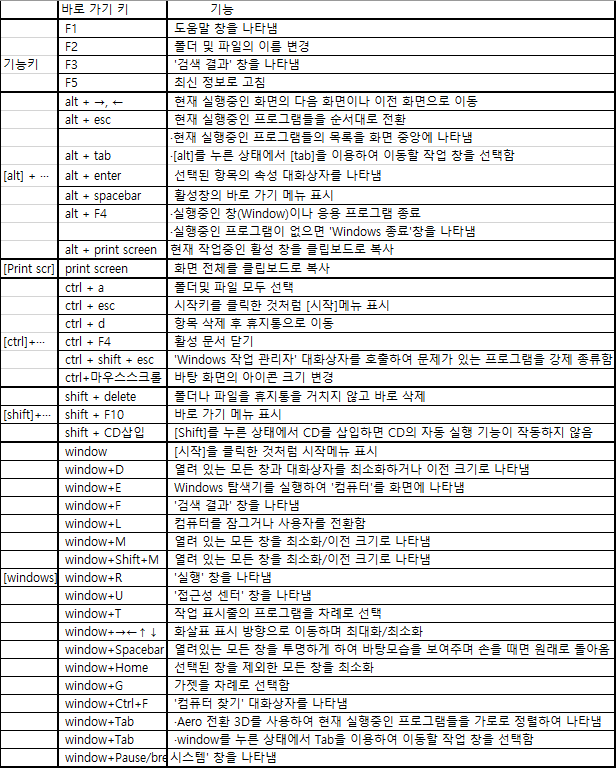

# 컴퓨터 일반

## 1. 최신 Windows의 특징
·그래픽 사용자 인터페이스(GUI) 사용: 키보드로 명령어를 직접 입력하지 않고, 
아이콘이나 메뉴를 마우스로 선택하여 모든 작업을 수행하는 사용자 작업 환경

·선점형 멀티태스킹(Preemptive Multi-tasking): 운영체제가 각 작업의 CPU이용 시간을 제어하는 응용 프로그램 실행중 문제가 발생하면 해당 프로그램을 강제 종료시키,
모든 시스템 자원을 반환하는 멀티테스킹 운영 방식
CPU: 컴퓨터의 정중앙에서 모든 데이터를 처리하는 장치
입력 받은 명령어를 해석해 연산한 후 그 결과를 출력하는 역할을 하게 된다.

·플러그 앤 플레이(PnP; Plug & Play): 컴퓨터 시스템에 하드웨어를 설치했을 때,
해당 하드웨어를 사용하는 데 필요한 시스템 환경을 운영체제가 자동으로 구성해주는 것

·OLE(Object Linking and Embedding): 다른 여러 응용 프로그램에서 작성된 문자나 그림 등의 개체(Object)를 현재 작성중인 문서에 자유롭게 
연결(Linking)하거나 삽입(Embedding)하여 편집할 수 있게 하는 기능

·255자의 긴 파일 이름: 최대 255자의 긴 파일 이름을 지정할 수 있고, NTFS에서 유니코드 문자를 지원하여 세계 여러 문자를 파일 이름에 사용할 수 있으며, 파일 이름으로는 
```
￦/:*?"<>|
```
를 제외한 모든 문자 및 공백을 사용할 수 있음

## 2. 파일 시스템
보조기억장치에 저장되는 파일에 대해 수정, 삭제, 추가, 검색 등의 작업을 체계적으로 할 수 있도록 지원하는 관리 시스템으로
종류에는 FAT(16), FAT32, NTFS가 있다.
```
         | ·MS-DOS 및 기타 Windows 기반의 운영체제에서 파일을 구성하고 관리하는데 사용되는 파일 시스템
FAT(16)  | ·MS-DOS를 포함한 Windows 98, 2000, XP 등에서 사용할 수 있음
*********************************************************************************************
         | ·FAT 파일 시스템에서 파생된 것으로 FAT보다 큰 드라이브를 사용할 수 있고, FAT에 비해 클러스터 크기가 작으므로 하드디스크의 공간낭비를 줄일 수 있음
FAT32    | ·Windows 98, 2000, XP 등에서 사용할 수 있음
*********************************************************************************************
         | ·성능 및 공간 활용, 보안, 안정성 면에서 FAT 파일 시스템에 비해 뛰어난 고급 기능을 제공함
NTFS     | ·Windows NT, 2000, XP, Vista, 7 등에서 사용할 수 있음
```

## 3. 한글 Windows 7의 새로운 기능
```
라이브러리   | 컴퓨터의 여기저기에 흩어져 있는 자료를 한 곳에서 확인하고 정리할 수 있게 하는 기능
***************************************************************************************************
홈 그룹      | 한글 Windows 7이 설치된 두 대 이상의 컴퓨터를 네트워크로 연셜해 파일 및 프린터를 쉽게 공유할 수 있도록 하는 기능
***************************************************************************************************
64비트       | 완전한 64비트로 데이터를 처리하므로 더 많은 양의 데이터를 빠르게 처리할 수 있으며,
데이터 처리  | 사용자에게 좀더 빠르고 간편하게 시스템을 구축할 수 있게 함
***************************************************************************************************
점프 목록    | 파일, 폴더, 웹 사이트 등 최근에 사용했던 문서나 작업을 더 빠르고 간편하게 이용할 수 있도록 프로그램별로 구성한 목록
***************************************************************************************************
프로그램 단추| 자주 사용하는 프로그램을 쉽게 실행할 수 있도록 
고정         | 작업 표시줄에 고정하는 기능
***************************************************************************************************
에어로 전환  | 작업 표시줄을 클릭하지 않고도 열려 있는 모든 창의 
3D           | 내용을 미리 볼 수 있음
***************************************************************************************************
에어로 스냅  | 열려 있는 창을 화면 가장자리로 드래그하여 창의
(Aero Snap)  | 크기를 조절할 수 있음
***************************************************************************************************
에어로 세이크| 창을 흔들어 다른 모든 열려 있는 창을 최소화할 수
(Aero Shake) | 있음
***************************************************************************************************
에어로 피크  | 현재 실행중인 프로그램을 통해 열린 모든 창들의 축소판 미리 보기가 가능하며,
(Aero Peek)  | 열려 있는 모든 창을 최소화하지 않고 바탕 화면을 볼 수 있음 
***************************************************************************************************
자려 보호    | 시간, 프로그램, 게임 등급 등에서 특정 사용자를 대상으로 컴퓨터 사용에 제한을 가할 수 있음
***************************************************************************************************
사용자 계정  | 유해한 프로그램이나 불법 사용자가 컴퓨터 설정을 
컨트롤       | 임의로 변경하지 못하도록 제어하는 기능
***************************************************************************************************
             | 시간이나 일정, 뉴스 등 컴퓨터를 사용하면서 자주 확인하는 정보를 손쉽게
가젯         | 볼 수 있도록 바탕화면에 표시할 수 있는 작은 프로그램
***************************************************************************************************
캡쳐 도구    | 화면의 특정 부분 또는 전제를 캡쳐하여 HTML, PNG, GIF, JPG 등의 파일로 저장할 수 있음
***************************************************************************************************
스티커 메모  | 종이에 메모 하듯이 일정이나 전화번호 등을 적을 떄 사용함
***************************************************************************************************
Windows      | 한글 Windows 7의 다양한 멀티미디어 파일을
Media Center | 한 곳에서 모두 재생할 수 있음
***************************************************************************************************
Windows DVD  | 사진이나 동영상 파일을 일반 DVD 플레이어에서 
Maker        | 재생할 수 있는 DVD로 만들 때 사용함
***************************************************************************************************
Windows      | 스파이웨어를 포함한 원치 않는 소프트웨어로부터
Defender     | 컴퓨터를 보호함
***************************************************************************************************
원격 미디어  | 홈 미디어에 인터넷을 연결하면 음악, 비디오, 사진을 장소에
스트리밍     | 관계없이어디서나 스트리밍할 수 있음
***************************************************************************************************
시동 복구    | Windows가 시작되지 않는 문제를 
(컴퓨터 복구)| 진단하지 않고 복구하는 기능
***************************************************************************************************
Windows      | 컴퓨터의 하드웨어 및 소프트웨어 구성 기능을
체험 지수    | 측정하고 측정값을 숫자(1.0~7.9)로 표시함
***************************************************************************************************
Windows      | 터치 스크린이 설치된 컴퓨터인 경우 손가락을
Touch        | 사용하여 마우스나 키보드의 작업을 대신할 수 있음
***************************************************************************************************
ReadyBoost   | USB 플래시 드라이브나 플래시 메모리 카드를 사용하여 컴퓨터 속도를 향상시키는 기능
```

## 4. 주요 부팅 메뉴(부팅 메뉴 표시: F8)

·컴퓨터 복구: 부팅에 문제가 있거나 시스템이 정상적으로 동작하지 않을 때 시스템을 초기 상태 또는 최적의 상태로 복원시키기 위한 메뉴로,
시스템 복구 작업은 '시스템 복구 옵션' 대화상자를 통해 이루어짐

·안전 모드: 컴퓨터가 비정상적으로 작동될 때 컴퓨터에 발생한 문제를 해결하기 위해 사용하는 방식으로, 
컴퓨터 작동에 필요한 최소한의 장치만을 설정하여 부팅하므로 네트워크 관력 작업이나 사운드 카드, 모뎀 등은 사용할 수 없음(해상도: 800*600)

·안전 모드(네트워킹 사용): 네트워크가 지원되는 안전 모드로 부틸하는 방식

·안전 모드(명령 프롬프트 사용): 안전 모드로 부팅하되, GUI 환경이 아닌 DOS 모드로 부팅함

·부팅 로깅 사용: 부팅 과정을 Ntbtlog.txt파일에 기록하며 부팅하는 방식으로, 문제가 있을 때 이 방법을 사용하여 부팅한 후
Ntbtlog.txt파일을 열러 문제가 발생한 부분을 확인할 수 있음

·저해상도 비디오 사용(640*480): 화면 모드를 640*480해상도로 설정하여 부팅하는 방식으로, 그래픽 카드 드라이버를 새로
설치한 후 한글 Windows 7이 제대로 실행되지 않을 때 유용함

·마지막으로 성공한 구성(고급): 마지막으로 시스템이 문제없이 실행되고 종료되었을 때의 레지스트리 정보와 드라이버를 사용하여 부팅하는 방식

·디렉터리 서비스 복원 모드: 디렉터리 컨트롤에서만 사용 가능한 방식으로, 
디렉터리 서비스를 복원할 수 있도록 Active Directory를 실행하는 Windows 도메인 컨트롤러를 시작함

·디버깅 모드: 네트워크로 연결된 경우 컴퓨터 관리자에게 해당 컴퓨터의 디버그 정보를 보내면서 컴퓨터를 시작함

·시스템 오류 시 자동 다시 시작 사용 안함: 시스템에 오류가 발생한 경우 시스템이 자동으로 다시 시작되지 않도록 지정함

·드라이버 서명 적용 사용 안함: 부적절한 서명이 포함된 드라이버를 설치할 수 있도록 함

·표준 모드로 Windows 시작: 한글 Windows 7의 기본 부팅 방식

## 5. 바로 가기 키(단축키)

</img>

## 6. 바로 가기 아이콘(단축 아이콘)
·자주 사용하는 문서나 프로그램을 빠르게 실행시키기 위한 아이콘으로,  원본 파일에 대한 위치 정보만 가지고 있다.
·컴퓨터에서 사용되는 모든 개체에 대해 만듷 수 있으며, 바로 가기 아이콘은 왼쪽 아랫부분에 화살표가 표시된다.
·바로 가기 아이콘을 삭제해도 원본 파일은 삭제되지 않는다.
·바로 가기 아이콘의 속성 창에서 연결된 대상 파일을 변경할 수 있다.
·바로 가기 아이콘의 이름, 크기, 항목 유형, 수정한 날짜등의 순으로 정렬하여 표시할 수 있다.
·바로 가기 아이콘의 확장자는 LNK이며, 한 개의 개체에 대해 여러 개 존재할 수 있다.
·바로 가기 아이콘 만들기
```
                   | ·개체를 선택한 후 바로 가기 메뉴에서 [바로 가기 만들기]를 선택함
바로 가기 메뉴 이용  | ·바탕 화면에서 마우스 오른쪽 버튼을 눌러 바로 가기 메뉴에서 
                   |[새로 만들기] -> [바로 가기]를 선택하여 실행 파일을 찾아 생성
**************************************************************************************
                   | 마우스 오른쪽 버튼으로 개체를 선택한 후
오른쪽 버튼으로 끌기 | 원하는 위치로 끌어다 놓으면 바로 가기 메뉴가
                   | 표시되는데, 이 중 [여기에 바로 가기 만들기]를 선택함
**************************************************************************************
Ctrl+Shift+드래그   | 바로 가기 아이콘이 바로 만들어짐
```

## 7. 작업 표시줄 및 시작 메뉴 속성
·'작업 표시줄' 탭
</img>

·'시작 메뉴' 탭

</img>

·'도구 모음' 탭 : 작업 표시줄에 표시할 도구 모음 지정

</img>

## 8. 점프 목록
·점프 목록은 파일, 폴더, 웹 사이트 등 최근에 사용했던
문서나 작업 목록을 프로그램별로 구성한 목록이다.

·자주 사용하는 항목은 점프 목록에 고정시킬 수 있다.

·점프 목록은 시작 메뉴와 작업 표시줄에 표시되며, 두 곳에 표시되는 점프 목록의 항목은 동일하지만
작업 표시줄의 점프 목록에는 해당 프로그램의 아이콘, 이 프로그램을 작업 표시줄에 고정/제거, 창 닫기 등의 메뉴가 추가로 표시된다.

·시작 메뉴의 [모든 프로그램]에는 점프 목록이 표시되지 않는다.

·점프 목록 표시
- 시작 메뉴: [시작] 단추를 클릭한 후 시작 메뉴에 고정된 프로그램 또는 최근에 사용한 프로그램 목록 
위로 마우스 포인터를 이동하거나 프로글매 옆의 화살표를 클릭함
- 작업 표시줄: 작업 표시줄에 표시된 프로그램 단추를 마우스 오른쪽 버튼으로 클릭함
·자주 사용하는 목록에 표시된 항목을 항상 표시되도록 고정시키려면 해당 항목의 바로 가기 메뉴에서 [이 목록에 고정]을 
선택하거나 해당 항목에 마우스 포인터를 놓았을 때 압정 아이콘을 클릭
·점프 목록에 최근에 열었던 파일 목록이 표시되지 않게하려면 '작업 표시줄 및 시작 메뉴'의 '시작' 
메뉴 탭에서 '최근에 사용한 항목을 저장하고 시작 메뉴 및 작업 표시줄에 표시'의 체크 표시를 해제하면 된다.

## 9. 시작 메뉴
·작업 표시줄의 가장 왼쪽에 있는 시작 단추나 Ctrl+Esc를 눌렀을 때 나타나는 메뉴
·시작 메뉴에는 Windows 7에 설치된 프로그램들이 메뉴 형태로 등록되어 있음
·프로그램의 아이콘을 시작 단추 위로 드래그하면 시작 메뉴의 '항상 표시되는 프로그램 목록'에 
추가되어 빠르게 실행할 수 있음
·최근에 자주 사용한 프로그램 목록 중 시작 메뉴에 항상 표시되게 하고 싶은 항목이 있으면
해당 항목의 바로 가기 메누에서 [시작 메뉴에 고정]을 선택
·시작 메뉴에 표시된 프로그램 목록을 삭제해도 실제 프로그램은 삭제되지 않는다.
·시작 -> 모든 프로그램 -> 시작 프로그램에  파일을 등록하면 한글Windows 7이 시작될 때 
자동으로 프로그램이 실행된다.

## 10. Windows 탐색기의 기능과 구조
·컴퓨터에 설치된 디스크 드라이브, 제어판, 응용 프로그램 파일 및 폴더 등을 관리할 수 있는 곳으로, 
파일이나 폴더, 디스크 드라이브에 관련된 모든 작업을 수행할 수 있음
·Windows 탐색기는 컴퓨터의 파일과 폴더를 계층(트리)구조로 표시
·구성 -> 레이아웃 메뉴에서 메뉴 모음, 세부정보 창, 미리 보기 창, 탐색 창, 라이브러리 창 등의 표시 여부를 선택할 수 있다.
·인쇄 기능(메뉴 모음의 [파일] -> [인쇄])을 사용하여 문서를 열지 않고도 바로 인쇄할 수 있음
·▷  폴더: 폴더 내에 또 다른 폴더, 즉 하위 폴더가 있음을 의미하며 ▷부분을 클릭하면 하위 폴더가 표시되고 ↘▲로 변경됨
· ↘▲ 폴더: 하위 폴더까지 표시된 상태임을 의미하며 ↘▲ 부분을 클릭하면 하위 폴더가 숨셔지고 ▷로 변경
·폴더 창에서 폴더를 선택한 후 숫자 키패드의 *를 누르면, 선택된 폴더의 모든 하위 폴더를 표시해 준다
·폴더 창에서 폴더를 선택한 후 왼쪽 방향키 ←를 누르면, 선택된 폴더가 열려있을 때는 닫히고,
닫혀 있으면 상위 폴더가 선택된다.
·폴더 창에서 폴더를 선택한 후 Backspace를 누르면 상위 폴더가 선택
·메뉴에 표시된 기호의 의미
```
-메뉴 뒤의 ▶ 표시: 하위 메뉴 포함
-메뉴 앞의 V 표시: 메뉴가 선택되어 적용된 상태로 동시에 여러 개를 선택할 수 있음
-메뉴 앞의 ● 표시: 여러 개 중에서 하나는 꼭 선택해야 하지만 하나만 선택할 수 있음
-메뉴 뒤의 ● 표시: 대화 상자가 있음
-매뉴가 흐리게 표시: 현재 사용할 수 없는 메뉴
```

## 11. 라이브러리
·라이브러리는 컴퓨터 여기저기에 흩어져 있는 자료를 한 곳에서 보고 
정리할 수 있게하는 가상의 폴더임
·라이브러리는 실제로 파일을 저장하고 있는 것이 아니라
파일이 저장된 폴더를 연결하여 보여준다.
·사진이나 음악처럼 자주 사용하는 폴더들을 하나씩 찾아다니지 않고 라이브러리에 등록하여 한 번에 관리할 수 있다.
·Windows에서는 기본적으로 문서, 음악, 사진, 비디오 라이브러리를 제공하고, 
이들 라이브러리에는 'C:\사용자\사용자 계정' 폴더에 있는 내 문서/내 음악/내 사진/내 비디오 폴더와
'C:\사용자\공용' 폴더에 있는 공용문서/공용 음악/공용 사진/공용 비디오 폴더의 내용이 표시된다.
·라이브러리를 추가하거나 삭제할 수 있는데, 새로 추가한 라이브러리에는 폴더가 있어야만 파일이나 하위 폴더를 복사할 수 있다.
·라이브러리에 폴더를 포함시키려면 해당 폴더를 선택한 후 바로 가기 메뉴에서
[라이브러리에 포함]을 선택하면 된다.
·하나의 라이브러리에는 최대 50개의 폴더를 포함시킬 수 있음
·라이브러리에 파일을 복사할 때 기본적으로 저장되는 위치(폴더)를 변경할 수 있음
·라이브러리에 포함된 폴더를 제거해도 원본 위치에 있는 파일이나 폴더는 삭제되지 않음
·라이브러리 폴더 안에 있는 파일이나 폴더를 삭제하면 원본 위치에서도 삭제된다.
·라이브러리 창에서 정렬 기능을 이용하여 파일들을 정렬하면 해당 라이브러리에
포함된 모든 파일들은 폴더 구분 없이 정렬 기준에 맞게 정렬된다.

## 12.. 폴더 옵션
·폴더 옵션에서는 파일이나 폴더의 보기 형식, 검색 방법 등에 대한 설정을 변경한다.

·실행 방법: Windows 탐색기에서 도구 모음의 [구성] -> [폴더 및 검색 옵션] 또는 메뉴 모음의 [도구] -> [폴더 옵션] 선택(바로 가기 키: Alt+T,O)
```
       | ·새로 여는 폴더의 내용을 같은 창 또는 다른 창에 열리도록 지정함
       | ·파일을 한번 클릭하면 실행되는 것과 같은 웹 사용 방법을 바탕 화면이나 Windows 탐색기
       | 등에서 사용하도록 설정함
일반    | ·<기본 값 복원> 클릭 시 설정되는 항목
       |  -폴더 찾아보기: 같은 창에서 폴더 열기 선택
       |  -마우스 클릭: 두 번 클릭해서 열기(한 번 클릭하면 선택됨)선택
       |  -탐색 창: 모든 폴더 표시 해제, 자동으로 현재 폴더 확장 해제
*********************************************************************************
       | ·메뉴 모음의 항상 표시 여부를 지정함
       | ·숨김 파일이나 폴더의 표시 여부를 지정함
       | ·응용 프로그램에 연결된 데이터 파일이나 실행 파일의 확작명 표시 여부를 지정함
보기    | ·제목 표시줄에 현재 선택된 위치의 전체 경로 표시 여부를 지정함(클래식 테마인 경우에만 적용)
       | ·미리 보기 창에 파일 내용 표시 여부를 지정함
       | ·폴더나 파일을 가리키면 해당 항목의 정보를 표시하는 팝업 설명의 표시 여부를 지정함
       | ·파일이나 폴더의 아이콘 앞에 확인란의 표시 여부를 지정함
*********************************************************************************
검색    | ·색인이 설정된 위치나 그렇지 않은 위치에 대해서 검색 방법을 달리할지 동일하게 할지 여부를 지정
       | ·하위 폴더 검색 여부, 부분적으로 일치하는 항목 찾기, 자연어 검색 사용 등의 검색 방법을 지정함
```

## 13.파일/폴더 속성
·파일/폴더의 속성을 이용하여 파일/폴더의 기본 정보를 확인하거나 특성 및 공유 여부를 설정할 수 있다.

·실행방법
```
 -도구/메뉴 모음 이용: 파일/폴더를 선택하나 후 도구 모음의 [구성] -> [속성] 또는
 메뉴 모음의 [파일] -> [속성]을 선택
 -바로 가기 메뉴 이용: 파일/폴더를 선택한 후 바로 가기 메뉴에서 [속성]을 선택
 -바로 가기 키 이용: 파일/폴더를 선택한 후 Alt+Enter를 누름
```
·탭별 기능
```
```
